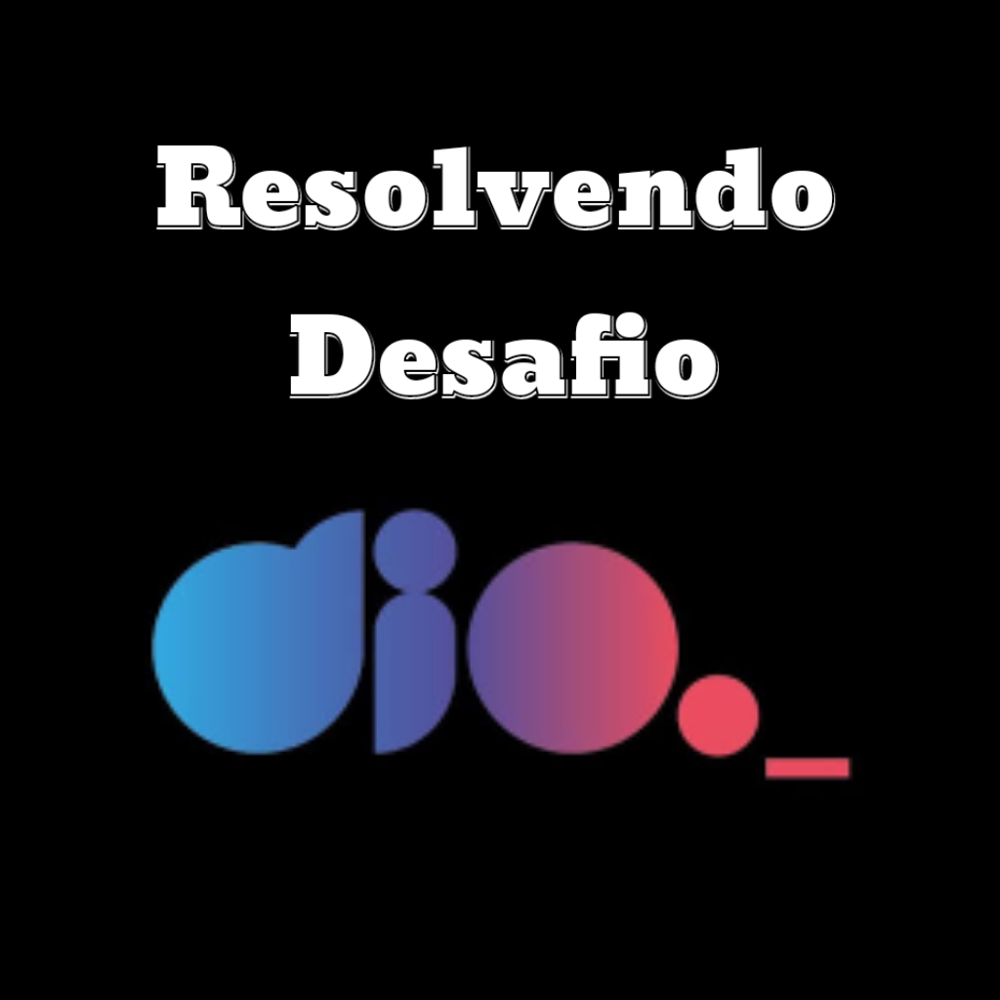
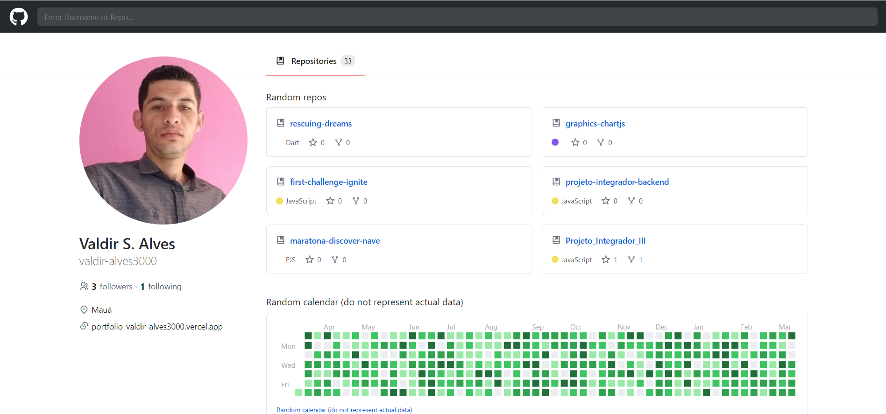

# Getting Started with Create React App

This project was bootstrapped with [Create React App](https://github.com/facebook/create-react-app).

## About project

This repository was created in order to show how we can create a frontend application with reusable components.

Developed by [Matheus Benites](https://github.com/benits/github-api-interface), [Youtube](https://www.youtube.com/playlist?list=PLTv2Rbwcr_Cru7KIHcffE1Shg9X9Eix7a), as a challenge for the dissemination of knowledge within the platform [DIO](https://dio.me/sign-up?ref=WXSFIF1TPZ), Come and be part of this team! :wink:

Or Developed by [Guilherme Rodz](https://github.com/rocketseat-content/youtube-clone-github), [YouTube](https://www.youtube.com/watch?v=iLEbGQXsg3k), as a challenge for the dissemination of knowledge within the platform [Rocketseat](https://app.rocketseat.com.br/), Come and be part of this team! :wink:

We will create an application using the github public api.

## Challenge

Understand how the integration with the api works, understand the responsibility of each component and develop the Application Layout.

### Preview

Print of the finished project.

## Techs

- [x] Fetch API
- [x] React.js
- [x] Styled Components
- [x] TypeScript

## Starting Dev Environment

1. Run `npm install` or `yarn install`. 
2. Run `yarn start` and access `http://localhost:3000`. 
